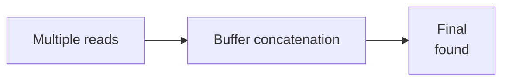

# 📖 get_next_line | 42 School Project

### Reading a file one line at a time, because why not reinvent the wheel? 😄


> *"Why stick to standard file I/O when you can create your own efficient line reader?"* - Every 42 Student Ever 😎

---

## 🎯 Project Overview

Welcome to my implementation of `get_next_line`, a function that reads a file descriptor line by line. This project dives deep into file handling, static variables, memory management, and system calls.

### 🌟 Key Features

- Reads a file one line at a time
- Handles multiple file descriptors simultaneously (Bonus)
- Uses dynamic memory allocation for efficient processing
- Includes robust error handling for edge cases like invalid FDs, EOF, and memory failures
- Norm-compliant and well-structured code

---

## 📜 Mandatory Requirements

### **Behavior**
- **Reads one line at a time**: Includes the newline (`\n`) if present
- **Returns NULL**: When EOF is reached or on an error
- **Supports dynamic buffer sizes**: Controlled via the `BUFFER_SIZE` macro

### **System Calls Used**
- **`read()`**: Reads data from a file descriptor into a buffer
- **`malloc()`**: Allocates memory dynamically for buffers and lines
- **`free()`**: Frees allocated memory to avoid leaks

---

## 📋 Supported Use Cases

- Reading files line by line
- Handling standard input (`stdin`)
- Dealing with valid and invalid file descriptors
- Edge cases like empty files, very large lines, and dynamic buffer sizes

### Example: **Reading from a file**
```c
#include "get_next_line.h"
#include <fcntl.h>
#include <stdio.h>

int main(void)
{
    int fd = open("example.txt", O_RDONLY);
    char *line;

    while ((line = get_next_line(fd)) != NULL)
    {
        printf("%s", line);
        free(line);
    }
    close(fd);
    return 0;
}
```

---

## 💻 Bonus Requirements

### **Additional Features**
- **Simultaneous file descriptors**: Handles multiple open files without losing the reading state of each
- **Static array for multiple FDs**: Uses a static array indexed by the file descriptor

### Example: **Reading multiple files simultaneously**
```c
#include "get_next_line_bonus.h"
#include <fcntl.h>
#include <stdio.h>

int main(void)
{
    int fd1 = open("file1.txt", O_RDONLY);
    int fd2 = open("file2.txt", O_RDONLY);
    char *line1;
    char *line2;

    line1 = get_next_line(fd1);
    line2 = get_next_line(fd2);
    printf("File1: %s", line1);
    printf("File2: %s", line2);

    free(line1);
    free(line2);
    close(fd1);
    close(fd2);
    return 0;
}
```

---

## 🚀 Getting Started

### Installation
#### 1. Clone the repository:
```bash
git clone https://github.com/yomazini/42Cursus-get_next_line.git
```
#### 2. Navigate to the project directory:
```bash
cd 42Cursus-get_next_line
```
#### 3. Compile with your project:
```bash
gcc -Wall -Wextra -Werror -D BUFFER_SIZE=42 your_program.c get_next_line.c get_next_line_utils.c
```

---

## 💡 Implementation Details

### Core Components
- **Main Function**: `get_next_line()`
- **Helper Functions**:
  - `read_line()`: Reads the file into a buffer until a line is complete
  - `extract_line()`: Extracts the next line and updates the static buffer
  - Utility functions like `ft_strlen`, `ft_strjoin`, `ft_strdup`, and `ft_substr` for string operations

### Static Variables
- A static variable is used to store leftover data from previous reads
- In the bonus part, an array of static variables is used to handle multiple FDs simultaneously

### Memory Management
- All dynamically allocated memory is freed to prevent leaks
- The buffer and any unused data are freed before returning NULL

---

## 🔄 Program Flow


### Flowchart Explanation of helper functions 

**1. Initialization Phase**


**2. Reading Phase (Green)**


**3. Line Extraction (Yellow)**


**4. Bonus Handling (Orange)**


**5. Error Handling (Red)**


### Key Components Table

| Component | Description | Memory Management |
|-----------|-------------|--------------------|
| Static Buffer | Preserves data between calls | Persists until EOF |
| read() Buffer | Temporary read storage | Freed after each read |
| Line Result | Returned to caller | Must be freed by user |
| FD Array (Bonus) | Stores per-FD state | Managed automatically |

### Execution Flow

1. **Initial Call**
   ```mermaid
   flowchart LR
       A[User calls gnl fd] --> B[Check buffer]
       B --> C[Read if needed]
       C --> D[Return line]
   ```

2. **Subsequent Calls**
   ```mermaid
   flowchart LR
       A[Buffer has data] --> B[Check for \n]
       B -->|Yes| C[Extract immediately]
       B -->|No| D[Read more]
   ```

3. **EOF Handling**
   ```mermaid
   flowchart LR
       A[Read returns 0] --> B[Return remaining]
       B --> C[Free buffer]
   ```

### Special Cases

**Empty File**


**Large Lines**


**Invalid FD**


-----


## Behind the Scenes: How the OS Manages Files

### Key File Management Tables
1. **Global File Table**
   - System-wide table tracking all open files
   - Contains file location, current position, and status flags

2. **File Descriptor Table (Per Process)**
   - Maps file descriptors (integers) to entries in the global file table
   - Each process has its own table

3. **Inode Table**
   - Stores file metadata (size, permissions, creation date)
   - Contains pointers to data blocks on disk

4. **Vnode Table**
   - Part of the Virtual File System (VFS)
   - Contains function pointers for operations (read, write, etc.)
   - Includes pointers to inodes

### How File Opening Works (Step by Step)
1. Process requests to open a file
2. Kernel locates the file in the file system
3. Kernel creates an entry in the global file table
4. Kernel assigns a file descriptor in the process's file descriptor table
5. The file descriptor points to the global file table entry
6. Kernel returns the file descriptor to the process
7. Process uses the file descriptor for operations

---
## 🎭 Author

Made with ☕️ and perseverance by **Youssef Mazini** (ymazini)
- 42 Intra: [ymazini](https://profile.intra.42.fr/users/ymazini)
- GitHub: [yomazini](https://github.com/yomazini)

----

> *"In files we trust, one line at a time!"* 😄
